============================
META-SHARE Provider Manual
============================


   
   *A Network of Excellence forging the Multilingual Europe Technology Alliance*

Authors: Victoria Arranz, Christian Federmann, Ioanna Giannopoulou,
Olivier Hamon, Marc Schröder, Christian Spurk

Date: November 8, 2012

.. contents::

------------------
Executive Summary
------------------

This document is a guide for those who are interested in providing 
Language Resources (LRs) with META-SHARE. It also explains user and
access rights management of the META-SHARE web editor.

-------------------------------------
User and Access Rights Management
-------------------------------------

Version 3.0 of the META-SHARE web application introduced a fine-grained
user and access rights management system which determines who may do
what on a META-SHARE node. For example, LR providers have more rights
than a normal user who just wants to download LRs, some non-provider
users may be members of an organization which grants special download
rights, etc.

This section describes the META-SHARE user and access rights management
system.

Basic User Roles and Permissions
==================================

META-SHARE knows the following user roles:

-  **anonymous user**: used for non-logged in users; no user account; 
   may browse published LR descriptions and can download free LRs; can 
   see node statistics.
-  **registered user**: personalized user account tied to an e-mail address;
   in addition to the rights of an anonymous user, a registered user may
   also contact LR maintainers for obtaining LRs which are not freely
   downloadable; can apply for editor group membership and for
   organization membership.
-  **editor member**: a registered user who is a member of one or more
   editor groups; may create his/her own LR descriptions and may upload
   smaller data files for them; may alter LR entries belonging to
   his/her editor group; may add owned resources to the editor groups
   (s)he is member of.
-  **editor group manager**: a registered user who manages a certain editor
   group; may accept or turn down applications for the managed editor
   group; may ingest, publish, unpublish and delete LRs belonging 
   to the managed editor group.
-  *organization member*: a registered user who is member of an internally
   known organization; get the rights of the organization.
-  **organization manager**: a registered user who manages an
   internally known
   organization; may add and remove registered users to/from the managed
   organization group.
-  **superuser**: a registered user who implicitly has all possible
   permissions of the META-SHARE web application; a superuser account is
   usually created during the installation of a node; superusers are 
   especially needed for creating editor groups, for making registered users
   editor managers, for creating organizations and for making registered
   users organization managers.
-  **node administrator**: the person who administers the META-SHARE node
   installation; not a META-SHARE web application role but the administrator
   should have a superuser account; apart from the node installation, a node
   administrator may be needed for uploading larger LR data sets.

In addition, there are the following permissions which can be granted to
a group or to individual user accounts:

-  **META-SHARE associate member**: this permission currently has no effect
   in the META-SHARE web application, however, it is expected to have
   in the future.
-  **META-SHARE full member**: this permission grants the right to freely
   download LRs with a META-SHARE Commons license.

*Note*: there are further permissions and a few more user roles in the
META-SHARE software. For example, one or more sync user accounts are
required for the node synchronization to work. These additional permissions
and roles are considered to be internal, though: resource providers will
not need to care about them and node administrators need only care where
these roles and permissions are explicitly mentioned in the META-SHARE
manuals.

Resource Ownership and Access
==============================

META-SHARE is all about LRs. Consequently, the META-SHARE `Basic User Roles and Permissions`_ are centered
around creating, modifying, accessing and otherwise managing these LRs.

Resource Owners
-----------------

A LR has zero or more owners, i.e., users who own the resource. The user
who creates a LR is usually the first owner of a LR. Owned LRs are listed
when going to “Manage Resources” → “Manage your own resources” in the
web editor. Additional owners can be added on that page, too. Only
superusers can withdraw LR ownership.

Owners may always edit their LRs, no matter if they are in an editor 
group of that LR (explained at `Editor Groups for Resources`_) or not.

Editor Groups for Resources
-----------------------------

A LR belongs to zero or more editor groups. As can be expected, editors
of these editor groups may edit such LRs. The user who creates a LR
determines what editor groups a LR gets by default (see below).
Additional editor groups can be added on the “My Resources” page of the
web editor (“Manage Resources” → “Manage your own resources”). Only
superusers can remove editor groups from a LR again.

Every user can choose the editor groups that newly created LRs shall get
by default. Only those editor groups can be chosen, of which the user is
a member. The user profile page (“Your Profile” → “Edit your profile”)
shows which editor groups these are (if any). Adding and removing default
editor groups can be achieved via the “Add default editor groups” and
“Remove default editor groups” menu items of the “Your Profile” menu in
the web editor.

Managing User Accounts
=======================

The META-SHARE User Manual explains how web application users can
register for a new user account. This section details how existing
META-SHARE user accounts can be provided with the different roles that
we introduced in `Basic User Roles and Permissions`_.

Managing Editor Users
-----------------------

An editor user is a user who is member of one or more editor groups.

Creating and Managing Editor Groups
`````````````````````````````````````````````

In a new META-SHARE installation there are no editor groups in the system
at all. A superuser first has to create them. Whenever a new editor
group is needed, it has to be created by a superuser.

You can ask the META-SHARE node superusers to create new editor
groups by going to ``<META_SHARE_NODE_URL>/accounts/contact/`` (e.g.,
http://metashare.dfki.de/accounts/contact/) and sending them a message.

To create or manage editor groups, choose “Editor groups” from the
“Administration” menu of the web editor. Creating new editor groups can
be accomplished with the “Add editor group” button in the top right
corner of the “Select editor group to change” page. You basically only
need to specify a meaningful name (such as “XYZ Corpus editors”) and
then save.

.. _applying-for-editor-group-memberships:

Applying for Editor Group Memberships
````````````````````````````````````````

Every registered user may **apply for membership** in one or more editor
groups, i.e., for being an editor user. Such an application is possible
from the “Your Profile” menu and then choosing the “Apply for editor
group membership”. Editor group managers of the applied-for group and 
superusers will be notified of the application.

As an editor group manager (or superuser) you can **accept or turn down 
an editor group membership application** by first choosing “Editor group 
applications” from the “Administration” menu of the web editor. From 
the editor group application list choose the application that you would 
like to accept or to turn down. Choose the relevant action at the top 
of the list and click the “Go” button.

Directly Adding a User Account to an Existing Editor Group
````````````````````````````````````````````````````````````

Superusers can directly add existing user accounts to an editor group. 
To do this, go to the web editor and choose “Users” from the 
“Administration” menu. Click the user you would like to add to an 
existing editor group. At the bottom of the “Change user” page in the 
“Groups” section, select the editor group you would like the selected 
user to be a member of.

Before you save your changes, make sure that the user has “Staff 
status” in the “Permissions” section.

Removing Users from Editor Groups
`````````````````````````````````````````````

Only superusers can remove users from editor groups. To do this, go to 
the web editor and choose “Users” from the “Administration” menu. Click 
the user you would like to remove from an editor group. At the bottom 
of the “Change user” page in the “Groups” section, deselect the editor 
group from which you would like to remove the selected user.

Managing Editor Group Managers
`````````````````````````````````````````````

Only superusers can manage editor group managers. Technically, a 
manager for some editor group is a user who is member of a so-called 
“editor group managers group” which manages that editor group. Thus, 
before you can make a user an editor group manager, you have to have a 
corresponding editor group managers group.

To **create a manager group**, choose “Editor group managers” from the 
“Administration” menu of the web editor and then click the “Add editor 
group managers group” button in the top right corner of the page. You 
need to specify a meaningful name (such as “XYZ Corpus editor group 
managers”) and select the editor group that shall be managed by the new 
manager group. Then save.

To **add members to a manager group**, you can either use the same 
method as described in `Directly Adding a User Account to an Existing
Editor Group`_
for editor groups. Or you can choose “Editor group managers groups” from
the “Administration” menu of 
the web editor, then select the editor group managers groups to which 
you would like to add new members, then choose the “Add users to 
selected editor group managers” action, then click the “Go” button and 
on the following page choose the users that you would like to have as 
members of the selected manager groups.

To **remove members from a manager group again**, you can either use 
the same method as described in `Removing Users from Editor Groups`_ 
for editor groups. Or you can choose “Editor group managers” from the
“Administration” menu of the web editor, then select the editor group 
managers groups from which you would like to remove members, then choose
the “Remove users from selected editor group managers” action, then click
the “Go” button and on the following page choose the users that you would
like to not be members of the selected manager groups anymore.


Managing Organizations
------------------------------

Creating and Managing Organizations
`````````````````````````````````````````````

In a new META-SHARE installation there are no organizations in the system
at all. A superuser first has to create them. Whenever a new organization
is needed, it has to be created by a superuser.

You can ask the META-SHARE node superusers to create new
organizations by going to <META_SHARE_NODE_URL>/accounts/contact/
(e.g., http://metashare.dfki.de/accounts/contact/) and sending them
a message.

To create or manage organizations, choose “Organizations” from the
“Administration” menu of the web editor. Creating new organizations can
be accomplished with the “Add organization” button in the top right
corner of the “Select organization to change” page. You basically only
need to specify a meaningful name (such as “ACME Corp.”) and then save;
usually you will not want to  change the preselected permissions except
for the cases described in `Granting Permissions`_ or if you really know
what you are doing.

.. _applying-for-organization-memberships:

Applying for Organization Memberships
`````````````````````````````````````````````

Every registered user may **apply for membership** in one or more
organizations. Such an application is possible from the “Your Profile” 
menu and then choosing the “Apply for organization membership”.
Organization managers of the applied-for organization and superusers
will be notified of the application.

As an organization manager (or superuser) you can **accept or turn down an
organization membership application** by first choosing “Organization 
applications” from the “Administration” menu of the web editor. From the 
organization application list choose the application that you would like to 
accept or to turn down. Choose the relevant action at the top of the list
and click the “Go” button.

Directly Adding a User Account to an Existing  Organization
`````````````````````````````````````````````````````````````

Superusers can directly add existing user accounts to an organization. To do 
this, go to the web editor and choose “Users” from the “Administration” menu. 
Click the user you would like to add to an existing organization. At the 
bottom of the “Change user” page in the “Groups” section, select the 
organization you would like the selected user to be a member of.

Removing Users from Organizations
````````````````````````````````````

Only superusers can remove users from organizations. To do this, go to the 
web editor and choose “Users” from the “Administration” menu. Click the user 
you would like to remove from an organization. At the bottom of the “Change 
user” page in the “Groups” section, deselect the organization from which you 
would like to remove the selected user.

Managing Organization Managers
--------------------------------

Only superusers can manage organization managers. Technically, a manager for 
some organization is a user who is member of a so-called “organization 
managers group” which manages that organization. Thus, before you can make a 
user an organization manager, you have to have a corresponding organization 
managers group.

To **create a manager group**, choose “Organization managers” from the 
“Administration” menu of the web editor and then click the “Add organization 
managers group” button in the top right corner of the page. You need to 
specify a meaningful name (such as “ACME Corp. managers”) and select the 
organization that shall be managed by the new manager group. Then save; 
usually you will not want to change the preselected permissions except for 
the cases described in `Granting Permissions`_ or if you really know what
you are doing.

To **add members to a manager group**, you can either use the same method as 
described in `Directly Adding a User Account to an Existing Editor Group`_
for editor groups. Or you can choose 
“Organization managers” from the “Administration” menu of the web editor, 
then select the organization managers groups to which you would like to add 
new members, then choose the “Add users to selected organization managers” 
action, then click the “Go” button and on the following page choose the users 
that you would like to have as members of the selected manager groups.

To **remove members from a manager group** again, you can either use the same 
method as described in
`Removing Users from Editor Groups`_
for editor groups. Or you can choose “Organization managers” from the
“Administration” menu of the web editor, then select the organization
managers groups from which you would like to remove members, then choose
the “Remove users from selected organization managers” action, then click
the “Go” button and on the following page choose the users that you would
like to not be members of the selected manager groups anymore.

Managing Superusers
-----------------------

In most cases it will probably suffice to have the single superuser account 
which was created during the installation of your META-SHARE node. However, 
if you should still want to grant further user accounts superuser 
permissions, you can proceed as follows: as a superuser, go to the web editor 
and choose “Users” from the “Administration” menu. Click the user whom you 
would like to make a superuser. On the “Change user” page in the 
“Permissions” section, make sure that “Superuser status” is activated and 
“Save”.

With the above procedure, the chosen user account will *implicitly* be 
granted all available permissions. You should never manually assign all 
permissions to a user account in order to make it a superuser; while this may 
partly give you the desired results, it will certainly not work in general.

Granting Permissions
==========================

Permissions are very fine-grained flags which control what users and groups 
may or mustn’t do in the META-SHARE web application. Only superusers can 
manage permissions. However, when using the mechanisms described in 
`Managing User Accounts`_, you will usually
*not* need to care about permissions at all – with one exception: 
META-SHARE memberships. Aside from META-SHARE memberships 
you should usually never change any of the built-in permissions – unless you 
really know what you are doing.

At some point you may want to make single users or organizations META-SHARE 
members. As noted in 
`Basic User Roles and Permissions`_, 
META-SHARE membership is controlled with 
two permissions (“META-SHARE associate member” and “META-SHARE full member”. 
To **grant one of these permissions to a single user**, go to the web editor 
and choose “Users” from the “Administration” menu. Click the user whom 
you would like to give the permission. On the “Change user” page in the 
“Permissions” section, make sure that either the “accounts | user profile |
Is a META-SHARE associate member.” permission or the “accounts | user profile | 
Is a META-SHARE full member.” permission is selected. Then save.

To **grant one of the permissions to a group of users** (usually to an
organization), go to http://<YOUR_NODE>/editor/auth/group/ of the web editor 
and click the group to which you would like to give the permission. On the 
“Change group” page under “Permissions”, make sure that either the “accounts 
| user profile | Is a META-SHARE associate member.” permission or the 
“accounts | user profile | Is a META-SHARE full member.” permission is 
selected. Then save.

--------------------------------
Provider-Oriented Documentation
--------------------------------

Add a Language Resource
========================

An editor user can add a new LR by inserting the *metadata* that describes 
this LR. The editor user must be registered and logged in so as to add new 
LRs, and then do as follows:

1. Click on the “Manage Resources” button in the top menu, then “Manage your 
   own resources”.

2. In the result page, click on the “Add Resource” button at the top right 
   corner of the page (see Figure 1). From the drop-down menu that appears, 
   click on “Resource”. The result page presents a drop-down menu, listing all 
   the available *resource types* (see Figure 2).

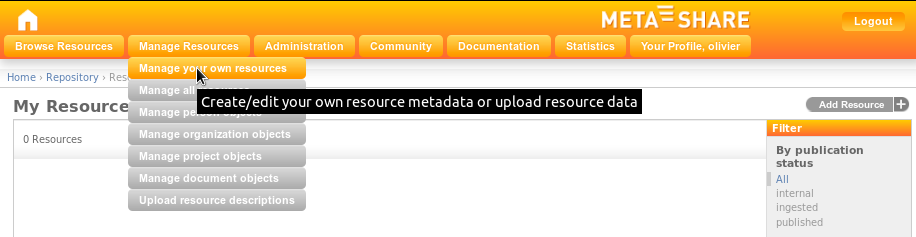

    Figure 1: META-SHARE backend for resource providers

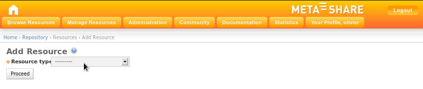

    Figure 2: Choose one of the available resource types


3. Choose a resource type for the LR (a LR can only have one resource type). 
   If your choice is “tool / service”, go directly to step 4.
   If your choice is of the other three resource types, select from the 
   appearing check-box list, the *media type(s)* for the LR (see Figure 3).

   **Note:** In the case of “lexical conceptual resource” and “language description”
   resource types, “text” is a required media type and, as such, it is selected by 
   default and cannot be unselected.

4. Click on the “proceed” button.

In the result page (see Figures 4 & 5), all the metadata information to be
filled in, is summarized under a left hand side menu (see 
`Metadata Fields`_ for the 
description of the metadata fields). On the top of this menu, there is the 
administrative information categorized as required, recommended and optional, if 
any. A click on any of these options, will lead in expanding the appropriate 
metadata block on the right hand side.

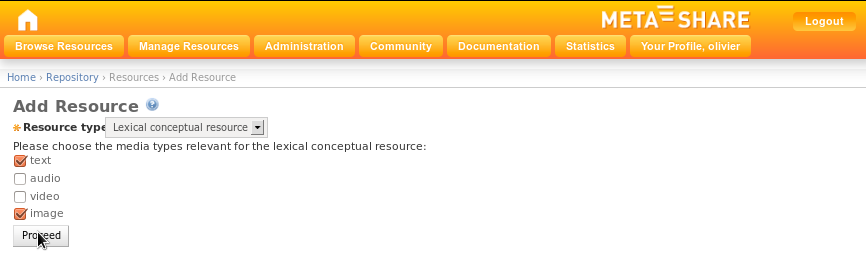

    Figure 3: Choose media types for the selected resource type

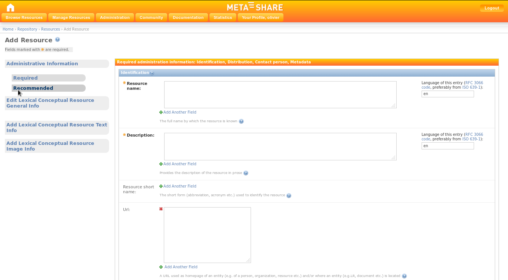

    Figure 4: Administrative Information metadata block (Required)

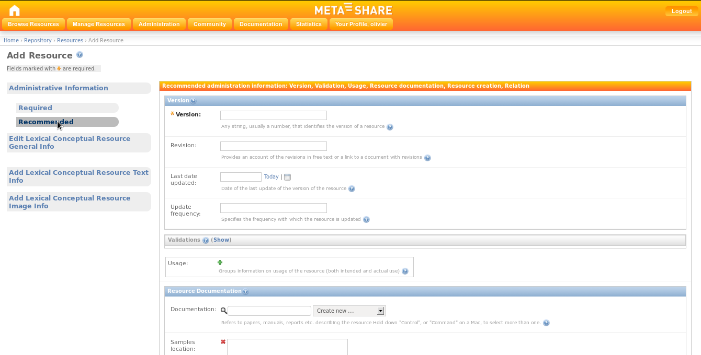

    Figure 5: Administrative Information metadata block (Recommended)

5. Fill in the administrative metadata fields (Only the required information
   -appearing as bold- is necessary for a LR to be successfully saved).

On the same level of the left hand side menu as the administrative information, 
there are the resource-type-specific information. Clicking on one of these, will 
lead in opening a pop-up window, containing the blocks of metadata to be filled in 
(see Figure 6 for an example). These pop-up windows follow a similar menu structure 
(required / recommended / optional) as the main page.

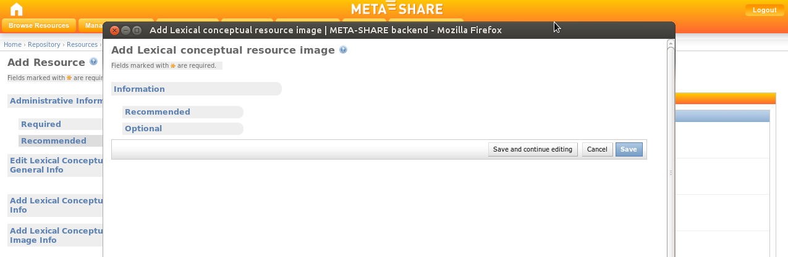

    Figure 6: Resource-type-specific pop-up window (here for a Lexical-Conceptual Resource)

6. For each one of the pop-up windows, fill in the metadata fields (again, only the 
   required information is necessary for a LR to be successfully saved). Once done 
   with filling in information within a pop-up window, click on the “Save” button at 
   the bottom of the page. In case of errors, a message will be displayed on the top 
   of the page, the errors will be reflected on the menu options and the problematic 
   fields (i.e., fields which either contain an error or are empty) will be 
   highlighted in red (see Figure 7 for an example). If there are no errors, the 
   “Save” button will close the pop-up window, returning to the previous page.


.. figure:: _static/provider_manual/fig07.png
    :align: center
    :alt: Errors in pop-up window: the media field has not been filled-in
    :figclass: align-center

    Figure 7: Errors in pop-up window: the media field has not been filled-in

7. Once done with filling in information both in the main page and in all the 
   pop-up windows, click on the “Save” button at the bottom of the main page. 
   If there are errors, they will be indicated in a similar way as in the 
   pop-up windows (see Figure 8 for an example). If there are no errors, 
   clicking on “Save” will result in a new page, displaying the message “The 
   Resource 'resource name' was added successfully”, and listing all the LRs 
   added in META-SHARE, included the newly created one (see Figure 9).

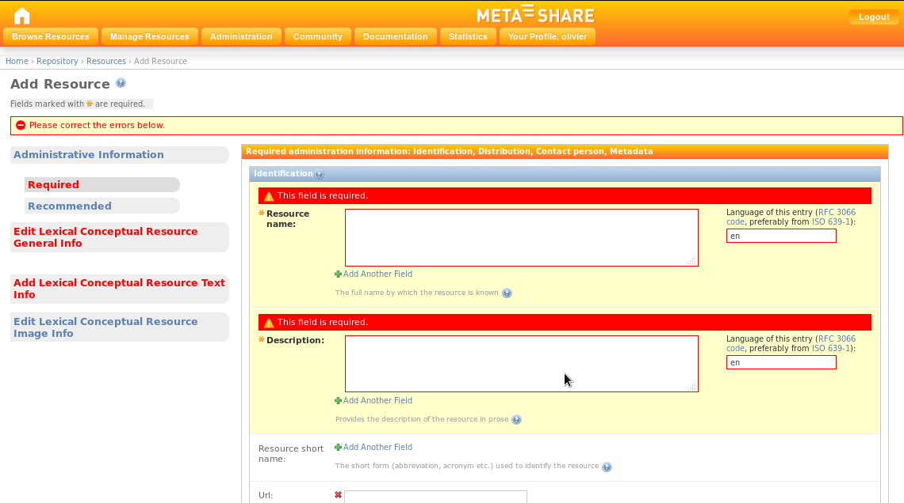

    Figure 8: Errors in main page: the resource name and the description have not been filled-in, errors also in General Info and Text Info tabs

.. figure:: _static/provider_manual/fig09.png
    :align: center
    :alt: Successfully saved LR
    :figclass: align-center

    Figure 9: Successfully saved LR


Edit Language Resources
------------------------

As described in 
`Basic User Roles and Permissions`_,
an editor user can edit all LRs within the specific META-SHARE node which he owns 
or which belong to the editor group of which (s)he is a member. In the menu, the 
editor user can click on the “Manage Resources” button, where (s)he can view a list 
of all the LRs / Person / Organizations / Projects / Documents for the specific 
META-SHARE node. The editor user can also click on the “My Resources” link, where 
(s)he can only view a list of the LRs (s)he has provided on META-SHARE himself (or 
more precisely: the LRs of which (s)he is set as an owner).

If the provider wishes to edit a LR, (s)he can click on its name. This will result 
in a page where all the metadata fields can be edited for this resource, which will 
appear in exactly the same view as described in
`Add a Language Resource`_.

Add Other Metadata Entities
============================

As shown in Figure 1, the editor user has a choice of creating other entities as 
well. The point of creating these types of metadata (namely Person, Organization, 
Project, Document) apart/independently from a resource, is that they can be 
reused in many LR descriptions. So, if for example a provider creates a project 
description first, then all (s)he has to do when creating a LR description, is to 
select the project from the list of existing projects, instead of creating it 
from scratch.

Manage Language Resources
================================
An editor group manager can delete, ingest, publish and unpublish all LRs that 
belong to his managed editor group. He can select the LRs to which (s)he wishes 
to apply one of these actions and then select an action from the drop-down menu 
of actions (delete, publish, unpublish or ingest). Clicking on the “Go” button 
will execute the selected action.

Export LR Descriptions to XML
====================================

An editor user is able to export the description of a LR to META-SHARE XML 
format. One way of performing the exporting is through the “export” action on the 
Update page for one or more LRs – as described in the previous section. Another 
way of exporting is through the metadata editing page, by clicking on the 
relevant button on the top right of the page (see Figure 10).

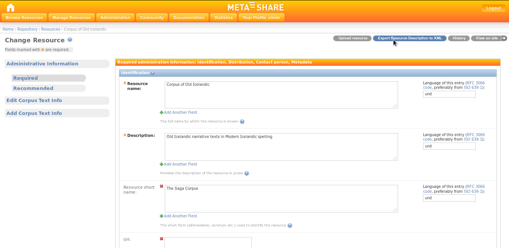

    Figure 10: Exporting a LR description to XML


Details of Adding and Editing Metadata Information
======================================================

Metadata information for LRs are organised in two levels, the first being 
Administrative / Type-specific, and the second being required / recommended / 
optional.

Metadata Fields
-----------------

The tabbed menu described in `Add a Language Resource`_ 
shows the two levels (see Figures 2, 3 & 4). A description of the metadata
fields follows:

- **Common fields:**

  1. Administrative
  
     i. Required: contains information on identification, distribution, 
        contact person, metadata of the resource, etc.
  
     ii. Recommended: contains information on version/release, validation, 
         usage, documentation, creation, relations of the resource, etc.
  
- **Resource type: Corpus**

  2. Corpus Text Info: Information on the text component of the resource,
     such as the language, the text format, the encoding, the annotation, etc.
  
  3. Corpus Audio Info: Information on the audio component of the resource, such 
     as the language, the audio format, the size, the recording, the capture, etc.
  
  4. Corpus Video Info: Information on the video component of the resource, such
     as the size, the video format, the content, the language, etc.
  
  5. Corpus Image Info: Information on the image component of the resource, such
     as the size, the image format, the content, etc.
  
  6. Corpus Text Numerical Info: Information on the numerical text component of
     the resource, such as the size, the content, the creation, etc.
  
  7. Corpus Text n-gram Info: Information on the text n-gram component of the
     resource, such as the base item (word, syllable, letter, etc.), the language, 
     the size, the text format, the encoding, etc.

- **Resource type: Language Description**

  2. Language Description General Info: Information on the specific type of 
     the resource (e.g. grammar), the encoding, the performance, etc.
  
  3. Language Description Text Info: Information on the text component of 
     the resource, such as the language, the linguality (monolingual, bilingual, 
     etc.), the text format, the encoding, the size, etc.
  
  4. Language Description Video Info: Information on the video component of the 
     resource, such as the creation, the size, the content, the video format, the 
     language, etc.
  
  5. Language Description Image Info: Information on the image component of the 
     resource, such as the creation, the size, the content, the image format, etc.

- **Resource type: Lexical Conceptual Resource**

  2. Lexical Conceptual Resource General Info: Information on the specific type of 
     the resource (thesaurus, terminology, etc.), the encoding, as well as further 
     details about the creation of the resource.
  
  3. Lexical Conceptual Resource Text Info: Information on the text component of
     the resource, such as the languages, the linguality (monolingual, bilingual, 
     etc.), the text format, the encoding, the size, etc.
  
  4. Lexical Conceptual Resource Audio Info: Information on the audio component of 
     the resource, such as the size, the audio format, the content, the language, etc.
  
  5. Lexical Conceptual Resource Video Info: Information on the video component of 
     the resource, such as the video content, the size, the video format, the 
     language, etc.
  
  6. Lexical Conceptual Resource Image Info: Information on the image component of 
     the resource, such as the image format, the size, the content, etc.

- **Resource type: Tool / Service**

  2. Tool / Service Info: Information on the specific type of the resource (tool, 
     service, platform, infrastructure, etc.), details about the input and output 
     types,  information on the operating systems and running environments, etc.

*Note:* All these fields are divided in blocks required / recommended / optional.

Input Types
--------------

In order to insert or modify metadata, the web application provides different kinds of input types:

- Text field: the editor user may add/modify free text that corresponds to
  the description of the metadata elements;

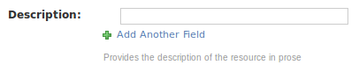

- Drop-down list box: the editor user may choose one item from the list provided;

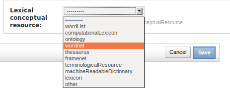

- Multiple-choice Drop-down list box: the provider may chose one or several 
  items from the list provided;

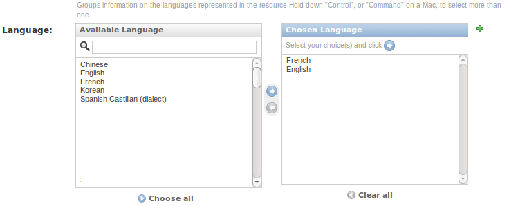


- Repeatable text field: the editor user may add or delete all the text 
  field he wants to by clicking on the “+” or “x“ buttons, respectively.

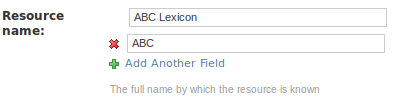

- Calendar text field: the editor user may write a full date on his own
  or select a date from a pop-up calendar.  

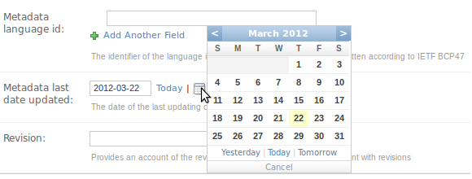


All fields are accompanied by a short description/explanation line, as shown below:

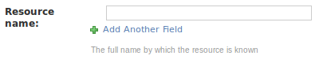


Import Language Resources
=================================

Prepare the Import File
-------------------------------
To be able to import new LRs, the user must first create XML *metadata files*
for each LR, that follow the META-SHARE metadata XML Schema. This compliance can 
be validated using the META-SHARE *XML Schema (XSD)*; the current version can be 
found in the ``misc/schema/v3.0`` folder.

Upload Using the Import Script
--------------------------------------

The META-SHARE node administrator (cf. 
`Basic User Roles and Permissions`_) may 
import XML metadata from the command line using the ``import_xml.py`` script which 
can be found within the `metashare` installation folder. Basic usage information is 
given when called without any arguments:

::

    $ python import_xml.py
      usage: import_xml.py [--id-file=idfile] <file.xml|archive.zip> \ [<file.xml|archive.zip> ...] 
      --id-file=idfile : print identifier of imported resources in idfile 

The script reports errors and gives import statistics when finished.
A single XML file can be imported as follows:

::

    $ python import_xml.py my_LR.xml
    Done.  Successfully imported 1 files into the database,
    errors occurred in 0 cases.

Multiple LRs can be imported using the “*” wildcard or by packaging the xml
file into a zip file:

::

    $ python import_xml.py metashare-v1-resources.zip
    Done.  Successfully imported 1,277 files into the database,
    errors occurred in 0 cases.

Importing a large zip file, or a large amount of XML files, takes some time;
this is normal. The last line of the ``import_xml.py`` output should report no 
errors. After successful import of these files, the new resources should be 
available on the META-SHARE node.

Upload Using the Web Interface
---------------------------------

An editor user can upload an XML metadata file by clicking on the “Upload”
link at the top left of the “META-SHARE backend for resource providers”
page. Uploading works as follows:

1. Choose a file by clicking on the “Browse button”;
2. Click on “Upload Terms” check-box to accept them;
3. Click on the “Upload” button.

Conversion of Existing LRs
-----------------------------------

The conversion of the existing LRs from several different XML schema to
META-NET XML schema has been made with XSL transformations.

The process was the following:

- The first step was to map all the elements of the other XML schema to
  the elements of META-NET XML schema, one by one. 

- Then, an XSL file was created, which contains the structure of META-NET XML 
  schema, and XSLT lines harvesting the information from the files of the other 
  XML schema format.
  
- The conversion process was executed for all given files.

Example:

Element ``resource_periodofcoverage`` from ELRA format has been mapped to 
``timeCoverage`` element in META-SHARE schema format.

*Line in ELRA XML file:*

.. code-block:: xml

    <resource_periodofcoverage>Between 1992 and 1999</resource_periodofcoverage>


*XSL conversion file:*

.. code-block:: xml

   <xsl:variable name='time' select='preceding-sibling::resource_periodofcoverage'/>       
   <xsl:if test='$time!=""'>
      <timeCoverageInfo>
         <timeCoverage>
            <xsl:value-of select='$time'/>
         </timeCoverage>
      </timeCoverageInfo>
   </xsl:if>

*Lines in final META-SHARE XML file:*

.. code-block:: xml

   <timeCoverageInfo>
      <timeCoverage>Between 1992 and 1999</timeCoverage>
   </timeCoverageInfo>

In the example above, the element *“timeCoverage”* is part of the meta-share
XML structure. The content inside the element is added by the line 
``<xsl:value-of select='$time'/>``, where ``$time`` is a XSL variable, defined 
before, as the (xpath) ``preceding-sibling`` with the name 
``resource_periodofcoverage``. If the variable is empty, the element does not 
appear in the final XSL file.

This is the way to construct, little by little, a META-SHARE compliant XML file.

For the conversion, there are many things that need to be taken into account, 
such as mandatory fields, unique fields, repeated fields, elements that have the 
enumeration constraint (i.e., that can only contain a value from a set of 
acceptable values), etc. Thus, the conversion files may contain far more 
complicated transformations than the one displayed before.

Due the complexity of the META-SHARE schema and the significant differentiation 
between this and the other formats,  some tools and mechanisms were used to 
simplify the conversion process.

In the case of ILSP and PSP resources conversion, the tool Altova-MapForce was 
used for the mapping between schemata and the production of the XSL files. Yet, 
there were quite a few cases where the automatically produced files had to be 
manually edited in order to fully comply with META-SHARE schema.

In the case of ELRA resources conversion, there was a pre-conversion stage, where 
the ELRA format files were converted in simple XML flat list files, with the 
following format:

.. code-block:: xml

   <resource id="1">
      <resource_id>1</resource_id>
      <resource_reference>ELRA-S0148</resource_reference>
      …
   </resource>
   <resource id="2">
	…

Files with this format were the input to the XSL file that were converted in 
META-SHARE format. The tool Altova-MapForce, facilitated here as well the mapping 
process.

Add  Downloadable Content to Resources 
========================================

Each META-SHARE resource can contain *downloadable* content. At the moment,
it is possible to add exactly one archive file to a resource. Its name is
fixed to ``archive.{'zip', 'tar.gz', 'gz', 'tgz', 'tar', 'bzip2'}``.

After upload, the ``archive.ext``, where ``.ext`` will be the file extension of 
the original file, will be placed inside the dedicated *storage folder* of the 
resource: each ``StorageObject`` has a local folder attached to it which is used 
to store associated downloadable data.

Adding Downloadable content
-----------------------------

There are two ways of adding downloadable content to an existing
META-SHARE resource:

1. Upload via the web interface (for editor users), or

2. Upload using the command line ``storage_admin.py`` script (for node
   administrators only)

Upload via the Web Interface
``````````````````````````````````````
To upload data via the Web Interface, the provider has to go to the
META-SHARE web editor page for *an existing resource*. It is *not* possible
to upload files for new LRs. On the top-right of the browser window, there is
a button "Upload Data" next to "Export Resource Description to XML".


Clicking the "Upload Data" button will load an upload page for the current LR.

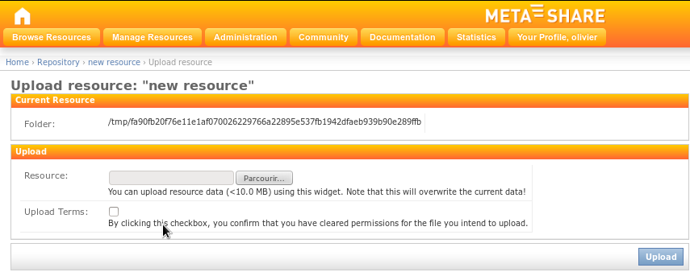

    Figure 11: Upload data for a LR

The “Path” information is displayed for convenience and allows to 
quickly retrieve the file system path of the `StorageObject`'s
downloadable content.

Both fields are required. In case the provider attempts to upload without
having filled them in, the fields are highlighted in red, with the
message “This field is required”.

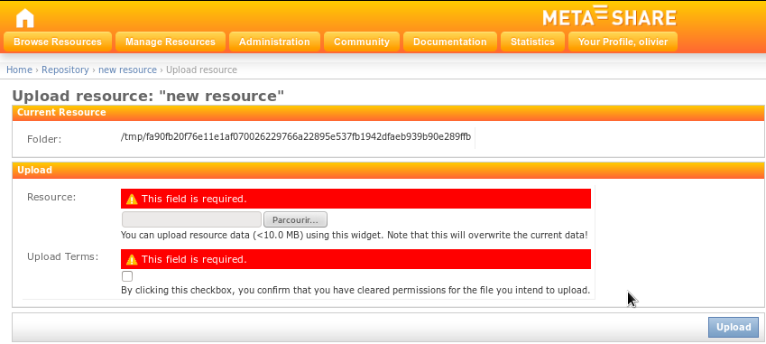

    Figure 12: Required fields for the upload


*Note:* It is required to click the “Upload Permission?” check-box to
verify that the editor user accepts liability for the file he intends
to upload. The editor user should only upload an archive to a META-SHARE
resource if he is allowed to do so; if not, it is better to ask the
original owner of the resource to do so.

Once the upload is successful, the file is copied to the
``StorageObject``'s storage folder as ``archive.ext`` (see above).
The user gets redirected to the editor page for the current resource,
i.e., the page where he started the upload process.

*Limitation:* The web interface upload page only allows files smaller than
MAXIMUM_UPLOAD_SIZE = 1 * 1024 * 1024 bytes to be uploaded. This is a robustness 
fix which ensures that the web editor page does not crash due to a very large 
file being uploaded. 
`Upload Using the Command Line storage_admin.py Script`_ offers a solution
for uploading larger files.

Upload Using the Command Line ``storage_admin.py`` Script
```````````````````````````````````````````````````````````````````

When you need to add a *large file* as downloadable content to an existing
resource, the node administrator can use the ``storage_admin.py`` script,
which is available within the ``metashare/`` folder.

If called without arguments, the script provides an overview on available options:

.. code-block:: sh

   metashare $ python2.7 storage_admin.py 
       usage: storage_admin.py MODE ARGS...
   
       MODE = [purge, checksum, folder, help]
       Use storage_admin.py help MODE for detailed usage instructions.

To add a large file as downloadable content, you simply have to manually copy
it over to the *storage folder* belonging to the resource. The *storage folder 
path* can be found in the web interface upload view (see 
`Upload via the Web Interface`_).

Once having copied a file named ``archive.ext`` to the *storage folder path*, you 
have to update the file checksum to “activate” the new downloadable content. This 
is the relevant usage of ``storage_admin.py``:

.. code-block:: sh

   metatashare $ python2.7 storage_admin.py checksum <storage-object-id>
   ...
   Checksum: d41d8cd98f00b204e9800998ecf8427e

You obtain the ``<storage-object-id>`` from the last bit of the storage
folder path: the ID is a 64-char hexadecimal String, e.g., 
c0b9a36b50ce11e1a4570017f20dda8ac8066602350044549d62c1bdb750883c.

If no file ``archive.ext`` can be found within the storage folder for
``<storage-object-id>`` the storage_admin.py script will return
``Checksum: None``.


Known Limitations 
-------------------

It is mandatory to follow the naming scheme. The provider has to make sure
that the downloadable data is contained within one archive file. This file
needs to have one of the following, allowed extensions (as defined in 
``storage/models.py``):

.. code-block:: python

   ALLOWED_ARCHIVE_EXTENSIONS = ('zip', 'tar.gz', 'gz', 'tgz', 'tar', 'bzip2')

-------------
4  Glossary
-------------

- Ingest: Within the META-SHARE context, ingesting a LR into the database is a 
  one-time, irreversible step. It is preceded by a phase of editing an “internal” 
  LR, visible only to the LR owners and to the members of the editor group of the 
  LR. Once the decision is taken that the metadata for a particular LR is “ready” 
  to make the entry more widely visible, the provider “ingests” the LR into the 
  database. An ingested LR is still visible only in the web editor. Ingested LRs 
  are synchronized to other META-SHARE nodes.

- Media types: Within the META-SHARE context, the media types of a LR depend on 
  its resource type. Thus, a Corpus LR can contain one or more of the following
  media types: text, audio, video, image, text-numerical and text-ngram. A 
  Lexical-Conceptual Resource must contain a text media type and can also 
  contain audio, video and image media types. A Language Description LR must 
  contain a text media type and can also contain video and image media types. A 
  Tool/Service does not contain any media types.

- Metadata: All the information that describes a given LR. Within the META-SHARE 
  context, metadata can describe all different aspects of a LR, varying from 
  details on the creation of the LR, to content or language or size information.

- Publish: Within the META-SHARE context, publishing a LR means making it 
  visible to all META-SHARE users, registered and anonymous.

- Resource type: Within the META-SHARE context, the resource type of a LR has to be strictly one of the following:

   * Corpus
   * Lexical-Conceptual Resource
   * Language Description
   * Tool / Service

- Unpublish: Within the META-SHARE context, unpublishing a LR means making it visible only to META-SHARE editors.

- XML metadata file: A XML format file that contains metadata on a LR.

- XML Schema (XSD): An XML Schema is a description of a specific XML type of
  files. It contains the structure that these XML files should have, along with 
  all the constraints that should be respected so that the XML files are valid,  
  such as the uniqueness of elements, the specific values that elements should 
  contain etc.

--------
Funding
--------

This document is part of the Network of Excellence “Multilingual Europe
Technology Alliance (META-NET)”, co-funded by the 7th Framework
Programme of the European Commission through the T4ME grant agreement
no.: 249119.
