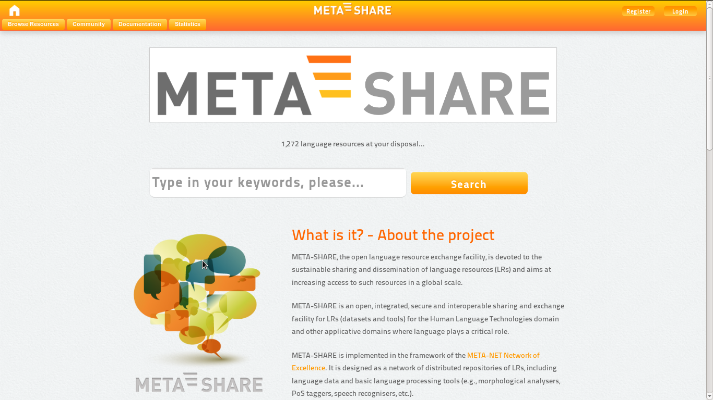
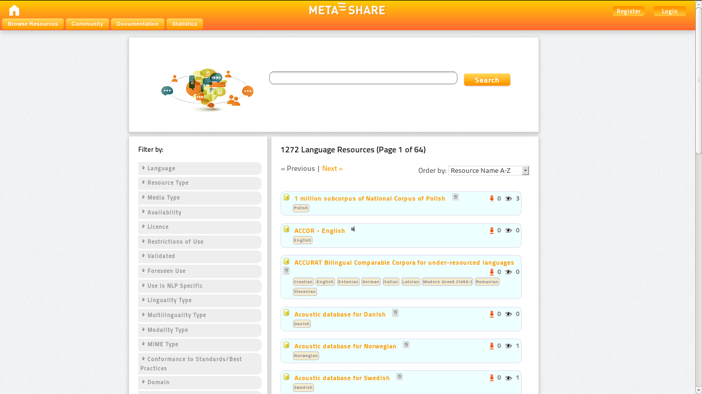
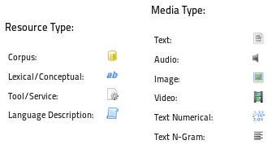
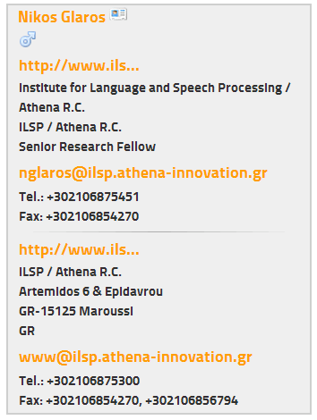
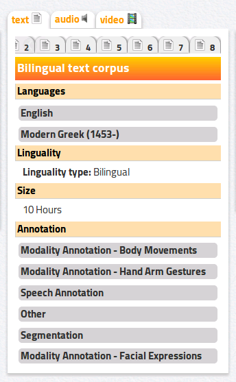
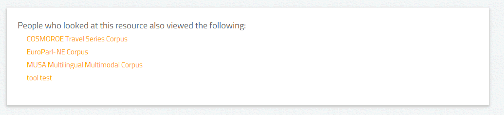
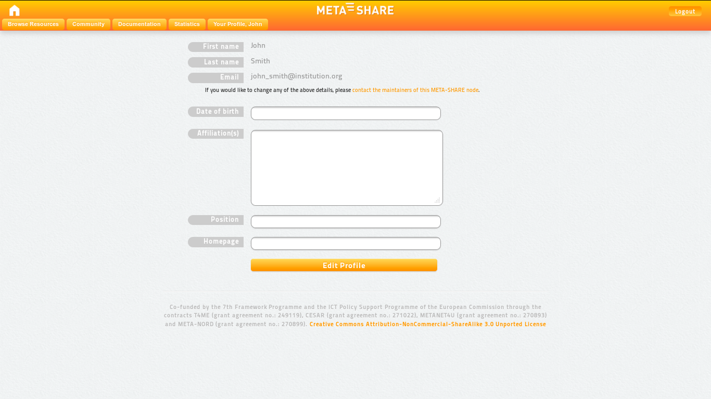
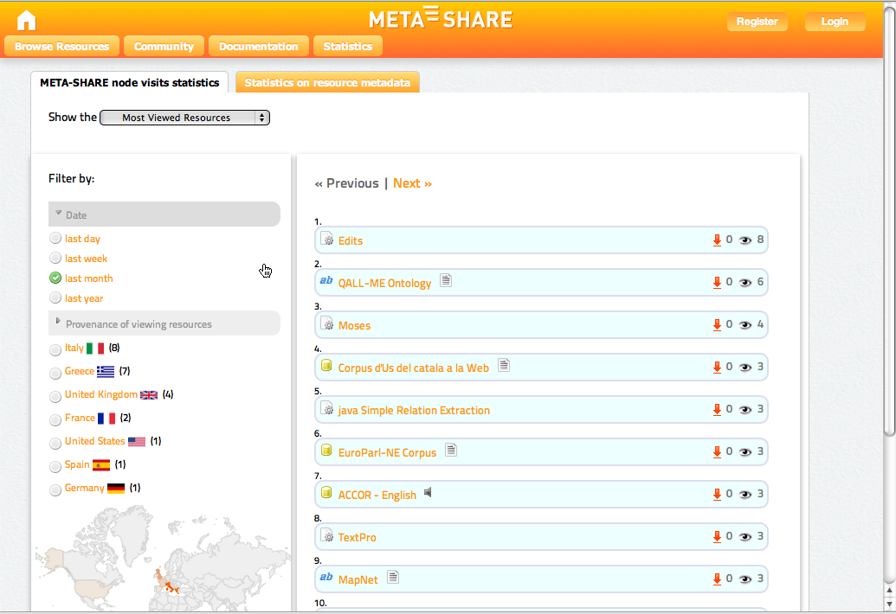
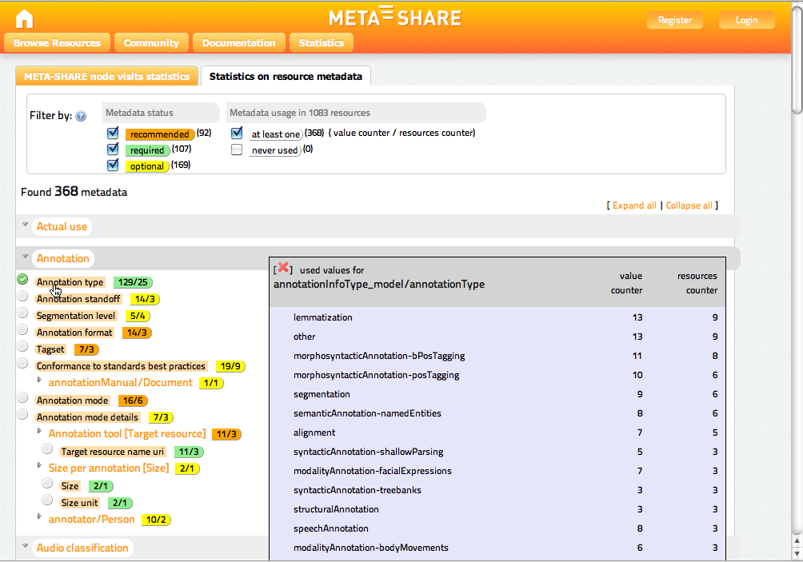
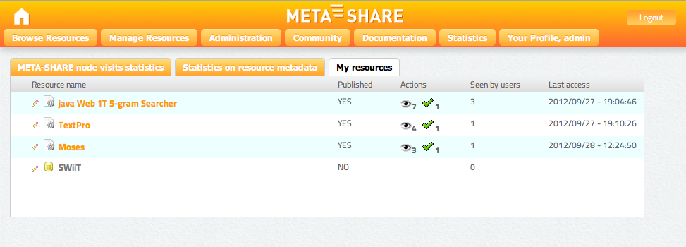

============================
META-SHARE User Manual
============================

.. figure:: _static/metanet_logo.png
   :align: center
   :alt: METANET logo
   
   *A Network of Excellence forging the Multilingual Europe Technology Alliance*

Authors: Bernardo Magnini, Manuela Speranza, Dimitris Mavroeidis, Christian Spurk, Olivier Hamon, Christian Girardi

Date: October 8, 2012

.. contents::

------------------
Executive Summary
------------------

This document is a guide for the users of META-SHARE. As such, it describes
the functionalities implemented in V3.0 of META-SHARE and provides the users 
with step-by-step explanations of how to exploit them.

-------------------------------------
Introduction
-------------------------------------

META-SHARE (http://www.meta-share.eu/ and http://www.meta-share.org/) is a 
network of repositories of language resource (LRs), including both language data 
and language tools, described through a set of metadata (see T4ME Deliverable 
7.2.4 for a detailed description of the schema of the metadata), aggregated in 
central inventories allowing for uniform search and access to resources. LRs can 
be both open and with restricted access rights, either for free or for-a-fee.

More specifically, META-SHARE V3.0 offers to the user the possibility to:

- search and browse the catalogue;
- view details about a LR;
- download a LR;
- view general statistics;
- have access as a registered user;
- access the community forum.

-------------------------------
User-oriented documentation
-------------------------------

Search and browse the catalogue
===================================

When looking for a LR, the user can perform both keyword-based search
and browsing of the catalogue.

Search the catalogue
------------------------

Both a simple search and a faceted search mechanism are available to
search through META-SHARE.



    Figure 1: META-SHARE homepage


Simple search
``````````````

The user can have access to the entire META-SHARE catalogue through a
simple keyword-based search:

1. Enter any word(s) into the text box at the top of the home page
   (see Figure 1).

2. Click on the “Search” button on the right of the text box or press
   “Enter” on the keyboard to begin the search. The search is performed
   over a subset of the metadata used to describe LRs; this subset is 
   composed of: ``resource name``, ``resource short name``, ``description``,
   ``resource type``, ``media type``, ``language name``, 
   ``language variety name``, ``annotation type``, ``licence``, 
   ``tool service type``, ``tool service subtype``, 
   ``lexical conceptual resource type``, ``language description type`` 
   and ``use NLP specific``. 

3. Results contain the search term in any of the searched metadata
   (over the union of the metadata, e.g. metadata_1 OR metadata_2 OR ...
   metadata_N), in the following ways:

   - a whole word;
   - combination of words: combined search will return resources
     containing all of the search terms entered (AND operator);
   - phrases: the user can enter words included in double quotes ("). 
     This kind of search will provide the user with an exact match of
     the quoted text.

The results page (see Figure 2) lists all the LRs matching the query (if
the user doesn’t type any word, the result consists of the entire catalogue).
For each LR, the following metadata information is provided:
``resource name``, ``resource short name (if available)``, ``resource type``,
``media type`` (see Figure 3) and ``language`` (if available). The number 
of downloads and the number of views are also given.

Faceted search
````````````````

On the left pane of the results page, there is a list of facets (or
filters). The user can filter the search results by any of the following
fields:
- Language
- Resource Type
- Media Type 
- Availability
- Licence
- Restrictions of Use
- Validated
- Foreseen Use
- Use is NLP Specific
- Resource Creator
- Linguality Type
- Multilinguality Type
- Modality Type
- MIME Type
- Conformance to Standards / Best Practices
- Domain
- Geographic Coverage
- Time Coverage
- Subject
- Language Variety

Filters can be combined with search terms entered in the search box. The
number of LRs available, if a specific filter is selected, are reported
alongside each group of LRs. When the user selects a filter, it's typeface
changes to bold. Multiple filters can be applied. For instance, if a user
requires a parallel corpus of English and French, he/she can select both
“French” and “English” in the “Language” field of the filtering pane as well
as “corpus” in the “Resource Type” field. Filters can be removed by
clicking again on the selected field. 

Browse the catalogue
----------------------

The user can browse the catalogue as follows:

1. Click on the "Browse Resources" button in the top menu;
2. The user can now browse the whole META-SHARE catalogue in two ways:

   - page through all LRs using the “Next” link which is provided both at
     the top and at the bottom of the LR list for that page;
   - browse the catalogue by using the filters on the left pane of the 
     results page (see `Faceted Search`_). 



    Figure 2: Results page



    Figure 3: List of resource and media types

The LRs can be ordered by using the select box on top right of the results
page by selecting one of the following item:

- Resource Name A-Z: order the results by resource name in alphabetical order;
- Resource Name Z-A: order the results by resource name in reverse
  alphabetical order;
- Resource Type A-Z: order the results by resource type in alphabetical
  order;
- Resource Type Z-A: order the results by resource type in reverse
  alphabetical order;
- Resource Name A-Z: order the results by media type in alphabetical order;
- Resource Name Z-A: order the results by media type in reverse alphabetical order;
- Resource Name A-Z: order the results by language in alphabetical order;
- Resource Name Z-A: order the results by language in reverse alphabetical order;
- Number of downloads: order the results by decreasing number of downloads;
- Number of views: order the results by decreasing number of views.

View details about a LR
========================

The user can click on the name of a LR from the results page obtained by
any type of search (see previous Section) to open the page with the details
for that LR (see Figure 4). Information about a LR includes all the metadata
information available for that resource (e.g. a textual description, the 
licensing conditions under which it is distributed, etc.) organized using 4 
panes, which are described in detail below. Numbers and dates are presented 
according to administrative settings. For instance, if the "LANGUAGE_CODE" is 
set to "en-gb", dates will be of the form "DD/MM/YYYY", and numbers of the form 
"XX,XXX.XX". 

.. figure:: _static/user_manual/fig04.png
    :align: center
    :alt: Page with detailed information for a single LR
    :figclass: align-center

    Figure 4: Page with detailed information for a single LR

Top pane
----------
The top pane provides vital information about the resource, like the resource 
name, short name and description. If the resource provider has supplied the 
above information in other languages, these can be shown on the click of a 
button. If a URL for the resource is provided, this is also shown here. In 
addition, on the top right corner of the top pane, statistical information about 
the number of times the resource was viewed, updated and downloaded are provided.


Left pane
----------

The bottom left pane provides legal and contact information. The former include 
license names and attributes, covering the wealth of information provided by the 
metadata schema. The latter include the person or organization to be contacted 
for details about the resource. Only the names of contact persons and 
organizations are shown at first. When clicked, a small frame is opened to 
reveal full details. All emails for persons and organizations are protected from 
bots and crawlers. URLs are truncated to prevent cluttering the resource view. 
See Figure 5 for more details.



    Figure 5: Person/organization view

Middle pane
------------

The middle pane provides media information. Available media types are: text, 
audio, video, image, n-gram text and numerical text. Each of these types is 
presented in an individual tab. When multiple instances of these types exist, 
they are presented in sub-tabs, as shown in Figure 6. 



    Figure 6: Media information for a single LR

Right pane
------------
The bottom right pane provides metadata creation information. Information about 
how, when and why the resource was created are presented.  Derived publications, 
manuals, associated resources and validation information are also part of the 
right pane. 

Bottom pane
------------
At the bottom of the page, there are recommendations about LRs that could be of 
interest to the user (see Figure 7). Recommended LRs are extracted from usage 
statistics (see `Statistics`_).  



    Figure 7: Media information for a single LR: Suggestions.

Download a LR
==============

If a LR is directly provided through META-SHARE, the user can download it from 
the page with the details for that LR (Figure 4). Steps to follow are:

1. Log in as described in `Log in`_.
2. Click on the “Download” button at the top left or bottom left of the page.
3. Accept the license terms under which the LR is distributed by ticking
   the corresponding box.
4. Click on the “Download Resource” button at the bottom of the page.

Access as a registered user
============================

Users can register to META-SHARE and log in to META-SHARE in order to
have access to further functionalities of the portal, such as downloading a LR. 
Being a registered user is also prerequisite for becoming a LR provider (see the 
:doc:`META-SHARE_User_Manual` for more information).

3.4.1 Register as a new user
In order to register to META-SHARE and get an account:

1. Click the “Register” button at the top right of the META-SHARE home page.
2. Fill in the “Create Account” form with an Account Name of your choice, 
   your First Name, Last Name, your Email address and the password of your choice.
3. Click the “Create Account” button.
4. The following message appears in the META-SHARE home page: “We have 
   received your registration data and sent you an email with further
   activation instructions.”
5. The system generates a message asking for a confirmation of the 
   registration and sends it to the address provided when registering.
6. Click on the link provided in the message to confirm the registration 
   (this has also the effect of logging in the user for the first time).
7. A confirmation message appears in the META-SHARE home page as follows: 
   “We have activated your user account.”
  
Log in
-------

Registered users can use their credentials to log in to META-SHARE:

1. Click the “Login” button at the top right of the home page (see Figure 1).
2. Fill in the “User Authentication” form with Username and Password.
3. Click the “Login” button.

At the end of the working session, the user can log out by clicking on the
“Logout” button at the top right of the home page.

If the user forgets its password, the system offers the possibility to
retrieve it:

1. Click the “Login” button at the top right of the home page.
2. Click on “Forgotten your password? Click here to reset your account”.
3. Fill in the “Reset Account” form with the Username and Email address used
   for the registration (both fields are compulsory).
4. Click the “Reset Account” button.
5. The system generates a message asking for a confirmation of the reset
   request and sends it to the user.
6. Click on the link provided in the message to confirm the request.
7. A confirmation message appears in the META-SHARE home page as follows:
   “We have re-activated your user account and sent you an email with 
   your personal password which allows you to log in to the website.”

Edit User Profile
-------------------

The user can edit his/her Profile:

1. Log in to META-SHARE (see `Log in`_).
2. Click the “Your Profile, <username>” button in the menu (this button is
   present only when the user is logged in), then “Edit your profile”.
3. Fill in the “Profile” form with a new Date of Birth, Affiliation(s), 
   Position, or Homepage.
4. Click the “Edit Profile” button.



    Figure 8: Profile form


In order to change the First Name, Last Name, or Email, the user should
contact the META-SHARE Helpdesk at helpdesk-technical@meta-share.eu

Apply for editor group membership
-----------------------------------

The user can apply to an editor group membership:

1. Log in to META-SHARE (see `Log in`_).
2. Click the “Your Profile, <username>” button in the menu (this button is
   present only when the user is logged in), then “Apply for editor group 
   membership”.
3. Select an editor group in the “Editor” select box.
4. Click the “Apply” button.
5. A confirmation message appears in the user profile page as follows: “You
   have successfully applied for editor group "<editor_group>".”

The application is moderated. When accepted by an editor group manager, the
user receives a notification email (see the
:ref:`applying-for-editor-group-memberships`).

Apply for organization membership
----------------------------------
The user can apply to an organization membership:

1. Log in to META-SHARE (see `Log in`_).
2. Click the “Your Profile, <username>” button in the menu (this button 
   is present only when the user is logged in), then “Apply for 
   organization membership”.
3. Select an organization in the “Organization” select box.
4. Click the “Apply” button.
5. A confirmation message appears in the user profile page as follows:
   “You have successfully applied for organization "<organization>".”

The application is moderated. When accepted by an organization manager, the
user receives a notification email (see the
:ref:`applying-for-organization-memberships`).

Access the community forum
===========================
Users can access a discussion forum where the META-SHARE community gives 
help regarding Legal, Technical and Metadata aspects. Click the 
“Community” button in the top menu to access the forum.

Statistics
===========
The “Statistics” button from the header tab allows the access to various 
types of statistical information about the use of META-SHARE node. 

META-SHARE node visits statistics
-------------------------------------

The first tab is the “META-SHARE node visits statistics”. By default, 
the system shows “the most viewed resources”; the user can select the other
lists from the select box on top of the statistics page (see Figure 9).

Five different lists are available:
- the most viewed resources;
- the top queries;
- the latest queries;
- the top downloaded resources.
- the latest updated resources.



    Figure 9: META-SHARE node visits statistics page 

The user can filter the statistics results by choosing one of the lists above,
combining it with other filters: Date filter and/or country of Provenance filter.

On the results tab, it is shown the resources results are shown (see Figure 9).
The user can visit each resource page by clicking on the resource name.
In each resource row in the results page, the following information is displayed:

- |eye|: the number of views for this resource.
- |downloadarrow|: the number of downloads for this resource.


The links “Previous” and “Next” at the top of the page are provided for 
easy navigation through sub page results.

Statistics on resource metadata
---------------------------------

This panel shows which metadata have been used to describe the META-SHARE
linguistic resources. 

To access this page the user should do the following (see Figure 10):

1. Click on the “Statistics” button from the header tab to see the statistics.
2. By default you are in the “META-SHARE node visits Statistics” tab.
3. Click on the “Statistics on resource metadata” tab.



    Figure 10: Statistics on resource metadata page

Two different filters appear at the top of the statistics page:

1. Metadata status: each metadata defined in the META-SHARE model (see
   more details on http://www.meta-share.org/portal/knowledgebase/home)
   can be either "required", "recommended" or "optional". The number after
   each component corresponds to the sum of components defined by the system. 
2. Metadata usage: 

   - “at least one” : presents the sum of components which have been used
     in resources.
   - “never used”: presents the sum of components which have not been used
     in resources.

The user can select from the two filters to have more specific statistics. By
activating one of the filters, the metadata are showed and grouped as defined
in the META-SHARE model. 

Under these filters, the user can find the metadata in rows. If a metadata
is used two counters are displayed. The first counter says how many times the
metadata has been filled in with a certain value, while the second counter
says the number of resources for which the metadata has been used.

For instance the counters of the “Annotation type” element 129/25, 
(see Figure 10), means that this required metadata has been filled in
129 times (possibly with redundant values), and that 25 different
resources have been described with that metadata.

Each used metadata can be also clicked showing a table with all filled
in values (see for example the values of “Annotation type” in Figure 10).

My resources statistics
-------------------------

The last statistics tab “My resources” (see Figure 11), is activated 
whenever a user is logged in. This tab is used to control the status
of the user’s resources. 

For each resource the following information are available:

- the type (as a specific icon) and the name of the resource. For a published
  resource its name can be clicked to go to the resource view page directly.
  The icon  opens its editing page
- the status of the resource (if it is published or not);
- the statistics about the actions made on the resource (the visualization
  is already described in the Section 3.2);
- the number of unique users that have visited the resource view page;
- the time of the last user visit.



    Figure 11: Statistics about user’s resources.


--------
Funding
--------

This document is part of the Network of Excellence “Multilingual Europe
Technology Alliance (META-NET)”, co-funded by the 7th Framework
Programme of the European Commission through the T4ME grant agreement
no.: 249119.
